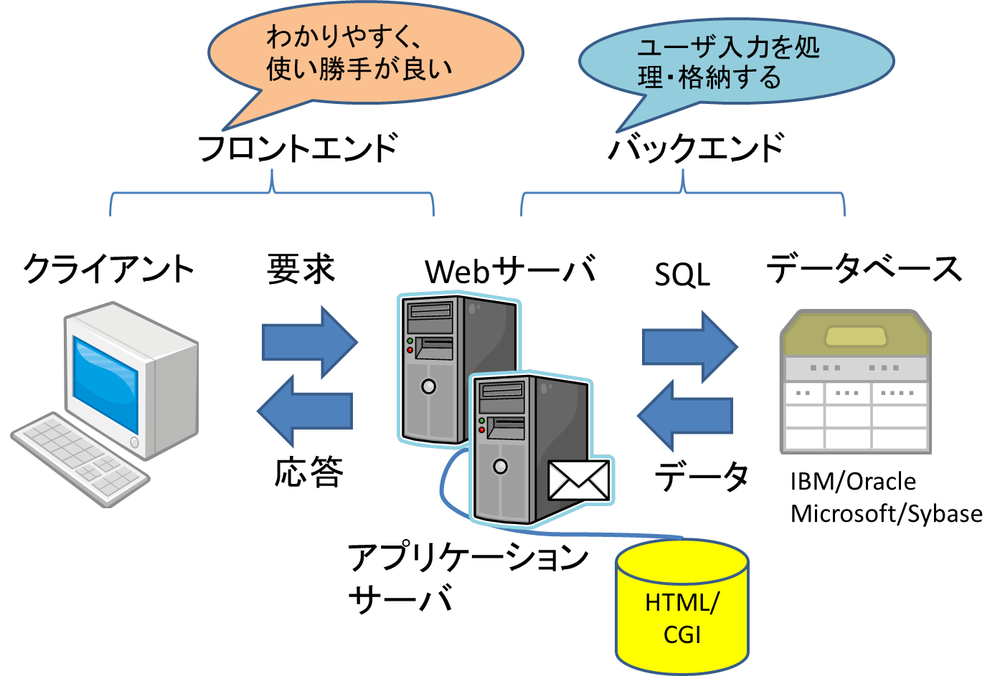

# Lesson1 Webサイト作成とは

## 1.1 Webページを作成する

- HyperText Markup Language(HTML)  
<a href="http://www.w3.org/" target='_blank'>Word Wide Web Consortium(W3C)</a>  
<a href="http://www.w3.org/japan/" target='_blank'>W3C(日本語)</a>
- Extensible HyperText Markup Language(XHTML)
- HTML5  
<a href="http://momdo.github.io/html51/Overview.html" target='_blank'>HTML 5.1 日本語訳</a>

### 1.1.1 Webページを構成するそのほかの要素

- データベースとWebページ
- WebページとCGI
	- Perl
	- PHP
	- ASP
	- ASP.NET
	- JSP & サーブレット <---> アプレット
	- SSJS => Node.js?
	- ColdFusion
- 携帯端末とマークアップ言語  
=> Wireless Application Protocol(WAP)

### 1.2 テキストエディタとマークアップ言語

- 書式なしのテキストとして保存
- .htm、.htmlというファイル拡張子で保存

### 1.3 Webオーサリングツール

- コードの手入力不要
- Graphical User Interface(GUI)

#### 1.3.1 マークアップ言語を学ぶ理由

- 最新のマークアップ言語対応
- スクリプト言語等の習得

### 1.4 フロントエンドについて

- ユーザとの接点となるWebページのこと

#### 1.4.1 Webページのアクセシビリティ

- 分かりやすく、使い勝手のよいフロントエンド
	- 政府によって作成された規格
	- W3Cなど業界で開発された規格
	- Webページが対象とする分野や業界団体
	- テキストベースのブラウザ
	- スクリーンリーダー技術
- ユーザ入力を処理・格納するサーバ(バックエンド)
	- Webページを楽にダウンロードできる
	- データベースへの正しい接続
- 通信環境、ブラウザ

- The Americans with Disabilities Act(ADA)
	- 1990年、米国で制定
	- 障害者の人権保護
	- 電子情報の利用 => サイバースペースのコミュニティ
	- 画像にはすべてテキストによる説明が付記
	- テキスト形式でないコンテンツにはテキスト形式の代替コンテンツを付ける
	- スクリーンリーダーで簡単に読み上げられる形式

- Web Content Accessibility Guidelines(WCAG)
	- W3CはWeb Accessibility Initiative(WAI)を設立
	- 「障害を持つ人々にも使いやすいWeb環境を促進」することで、Webの可能性が発揮

- WCAG準拠要求事項
	1. 代替手段の用意
	1. 色に依存しない表現
	1. 適切なマークアップ言語とスタイルシートの使用
	1. 自然言語を明示
	1. テーブルを正しい要素で使用する
	1. 新技術を採用した場合は代替形式を提供する
	1. 動きのある内容をユーザが自由に変更できる
	1. 埋め込まれたユーザインタフェースへのダイレクトなアクセシビリティを確保
	1. デバイスに依存しないデザイン
	1. 暫定的な解決法を使用
	1. W3Cが推奨する技術とガイドラインの使用
	1. コンテンツの背景や方向付けを明らかにする
	1. わかりやすいナビゲーションの仕組みを提供する
	1. 分かりやすく簡潔なドキュメントとする

- 優先度
	- 優先度１  
	すべてのユーザにアクセシビリティを提供するには、このチェックポイントを満たす必要がある
	- 優先度２  
	Webコンテンツ開発者はこのチェックポイントを満たすことが強く推奨される
	- 優先度３  
	Webコンテンツ開発者はこのチェックポイントを満たすよう取り組むことが望まれる

- ３つの準拠レベル
	- 準拠レベル「A」  
	優先度１のチェックポイントすべてが満たされている
	- 準拠レベル「Double-A」  
	優先度１と２のチェックポイントがすべて満たされている
	- 準拠レベル「Triple-A」  
	優先度１と２と３のチェックポイントがすべて満たされている

- Rehabilitation Act(リハビリテーション法) 第508上  
2001年6月21日「電子情報技術アクセシビリティ基準」  
連邦政府の各部局が開発、調達、保守、使用する電子情報技術において、すべてのユーザが  
同様にアクセスできるものでなければならない  
WAIが定めたWCAG1.0の優先度１および２のチェックポイント  

- COPA(Child Online Protection Act/児童オンライン保護法)  
1988年、未成年者が有害情報に触れる機会を減らすことを目的として制定

- アクセシビリティ検証ツール

#### 1.4.2 Webページのアクセシビリティで考慮すべき点

- 視覚障害者への対応
- 聴覚障害者への対応
- 認知障害、あるいは技術的な制約がある場合の対応

#### 1.4.3  サイトマップ

- セクションの階層表示  
サイトの構成を階層構造でわかりやすく
- 適切なセクション名  
わかりやすく適切な名前を
- 検索機能  
ユーザが求める情報を検索できるしくみ

#### 1.4.1 クリエイティなデザインとブランド戦略

企業のWebページ -> 重要なマーケティングツール  
ブランド・名称の認知確立 -> マインドシェアの概念

- デザインとブランド戦略に関するミーティング
- アクセスを増やすテクニック
	- メール配信
	- ユーザトラッキング

#### 1.4.5 ポータル

- 垂直ポータル  
特定の話題や分野に特化したポータル  
特定のトピックに焦点を絞ったコンテンツ
- 水平ポータル  
特定のトピックに限定せず、あらゆるWeb  
サイトやコンテンツを集約したポータル

#### 1.4.6 Wikiサイト

ユーザ自身がコンテンツの作成に参加できる

#### 1.4.7 ファイル形式とアクティブコンテンツ

- MIME(マイム)タイプ  
WebサーバがWebブラウザにコンテンツを送信する際に使用  
コンテンツのファイル形式を表現

### 1.5 Webサイトのバックエンド

#### 1.5.1 データベース接続

- データベースの種類
	- フラットファイル
	- リレーショナルデータベース
	- オブジェクト指向データベース

- データベース、Webサーバ、SQL  
	- クエリー実行で使用するSQL

- リレーショナルデータベースのための用語
	- 内部結合(inner join)  
	両方のテーブルに共通するレコードのみ
	- 外部結合(outer join)  
	片方のテーブルに該当するレコードが存在しない場合も

#### 1.5.2 ダウンロードにかかる時間と帯域幅の関係

- ページ全体のサイズが100KBを超えない程度
- Webページのダウンロード所要時間を求める

#### 1.5.3 HTMLファイル名の付け方

- 拡張子 => .htm、 .html
- 上記以外 => .php、.jsp、.asp、
- デフォルトページ
	- (index|default|welcome|home).(htm|html|asp|jsp|php)