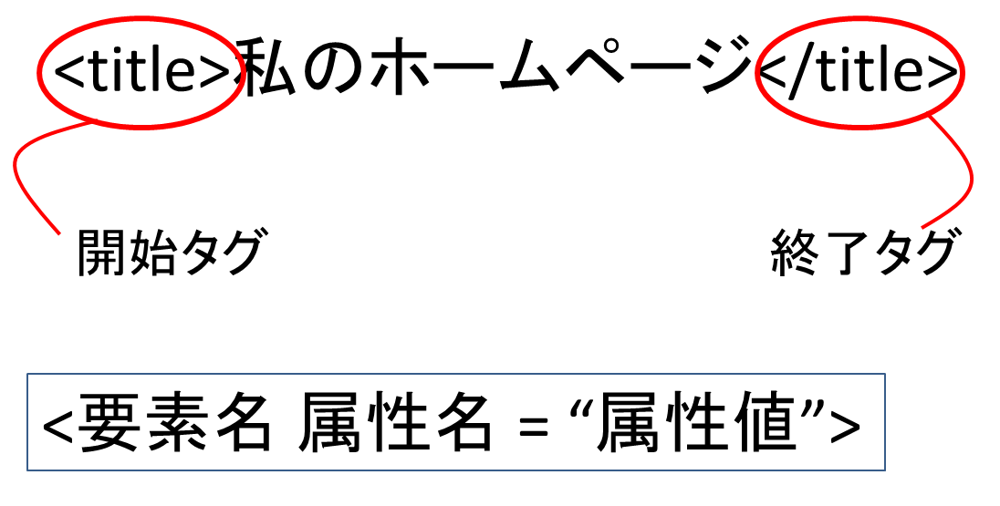
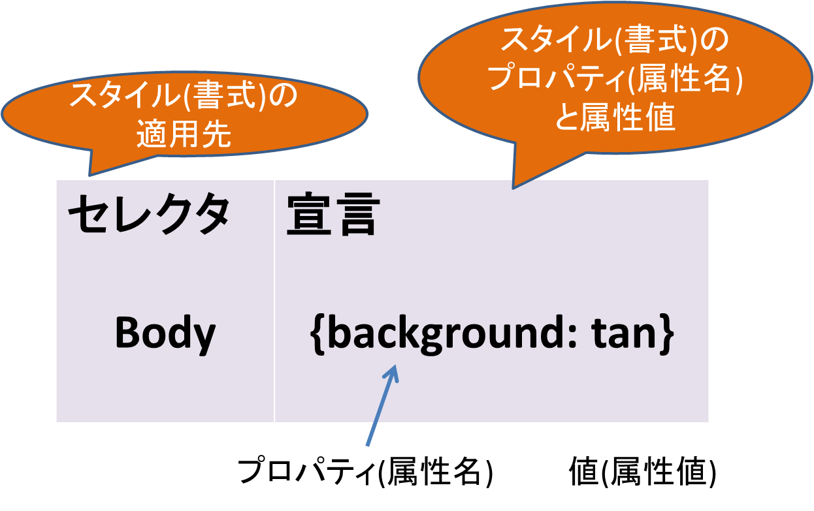
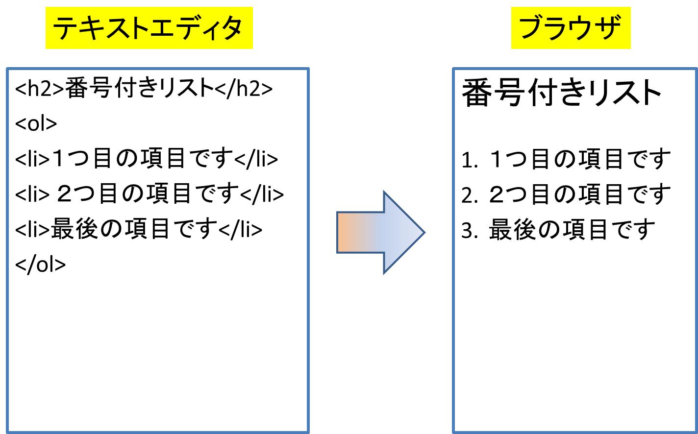
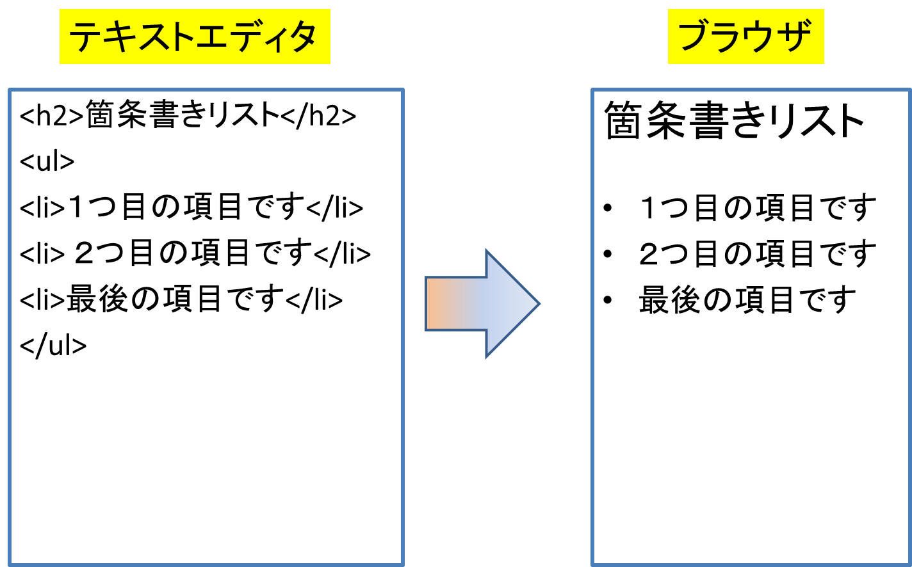

# Lesson3 XHTMLのコーディング

## 3.1 XHTMLの利用について

## 3.2 XHTMLのタグと要素

### 3.2.1 要素の書き方

- 開始タグと終了タグの2つを対にして記述
- 終了タグにはスラッシュ(/)が含まれる
- 囲む内容が空の場合は、空要素の記述でも可

### 3.2.2 タグの構成

<p></p>

- 要素名 => タグによって記述する要素の名称
- 属性 => それぞれの要素に応じた特定に指示
- 属性値 => 属性に、具体的な数値や単語を指定．属性に続き「=""」の形で記入

## 3.3 文書構造を記述する要素

- DOCTYPE要素 => 文書の種類を示す
- html要素 => XHTML文書全体
	- head要素 => ヘッダ部
		- meta要素 => 文書の付加情報
		- link要素 => スタイルシートの参照
		- title要素 => 文書のタイトル
	- body要素 => 本文

### 3.3.1 XHTMLにおける大文字と小文字の区別

- 全ての要素と属性は小文字で記述する

### 3.3.2 DOCTYPE宣言(文書型宣言)

- 文書の種類を指定
- 文書の冒頭に記述

### 3.3.3 ```<html>```タグ

- xmlns属性 => 名前空間の指定
- lang属性 => 文書内で使用する言語

### 3.3.4 ```<head>```タグ

- ```<meta>```タグ
	- http-equiv属性  
	HTTPレスポンスヘッダと同等の効果。ページの自動更新、  
	他のURLへの転送
	- content-type属性 => MIMEタイプを指定
	- name属性 => keywords, descriptionなど
	- content属性  
	http-equiv, content-type, nameとの組み合わせ
- ```<link>```タグ => スタイルシートの参照
- ```<title>```タグ => コンテンツのタイトルを表示

### 3.3.5 ```<body>```タグ

- bgcolor属性 => ページの背景色
- backgroud属性 => ページの背景の画像
- link属性 => ハイパーテキストリンクの色
- 属性値は二重引用符(")で挟んで記述

## 3.4 Webサイトのファイル構造

## 3.5 開発環境の準備

## 3.6 スタイルシート

### 3.6.1 CSSの用語

<p></p>

### 3.6.2 CSSの正しい書き方

```
body {
	font-family: arial, erdana, helvetica;
	color: gray;
	font-size: 10pt;
}
h1 {
	font-family: arial, sans-serif;
	/* color: gray; */
	color: black;
	font-size: 24pt;
}
```

### 3.6.3 継承

- CSSで定義したスタイルは、他のページに特に優先するスタイルが  
記述されていない限り、文書中で有効
- Webページ内で```<style>```タグを使って指定された書式の設定は、  
CSSの設定に優先する

### 3.6.4 CSSとXHTML

- ```<head>```タグで、```<link>```タグを使って外部スタイルシートへのリンク  
を指定する方法(推奨されている方法)
- ```<head>```タグで、インポート先を指定して外部スタイルシートをインポートする方法
- ```<head>```タグで、スタイルシートの記述を直接埋め込む方法
- 個々のタグで、スタイルを直接指定する方法(インラインスタイル)

### 3.6.5 CSS使用の利点

- 一貫性の維持
- 変更管理の容易さ

### 3.6.6 スタイルシートと互換性

- スタイルシートをインポートではなく、リンクして使う

## 3.7 段落とブロック要素について

- ブロック要素  
少なくとも1つの段落全体に効果を及ぼす  
自動的に改行が挿入され、段落が区切られる
- インライン要素  
単一の文字やテキスト全体に効果を及ぼす  
自動的に改行は挿入されない

### 3.7.1 段落指定と改行

- ```<p>```  
 ```<p>```タグで段落の始まりを指定し、```</p>```タグで段落の終わりを指定
- ```<br>```  
文を改行、```<br/>```のように空要素として記述

### 3.7.2 見出しレベル

- 見出しは```<h1></h1>``` ~ ```<h6></h6>```でタグ付け

### 3.7.3 タグのレスティング

- OK => ```<h1><i>...</i></h1>```
- NG => ```<h1><i>...</h1></i>```

### 3.7.4 整形済みタグ<pre>

- 元の体裁を保ったままテキストを表示できる

### 3.7.5 インデントとセンタリング

- ```<div align=“center”>文字列</div>```  
=> ```<div>```タグでかこまれている部分を中央揃え
- ```<div align=“right”>文字列</div>```  
=> ```<div>```タグでかこまれている部分を右揃え
- ```<blockquote>文字列</blockquote>```  
=> ```<blockquote>```で囲まれている部分をインデント
- 以下はHTML4.01とXHTML 1.0 Transitionalで非推奨  
=> ```<center>文字列</center>```

### 3.7.6 その他のブロック要素

- フォーム、罫線、リストなど

## 3.8 インライン要素

- 小さなものなら文字1つに対して、大きくなるとテキスト全体

### 3.8.1 太字、イタリック、アンダーラインテキスト

- ```<b>```、```<strong>``` => 太字体テキスト
- ```<i>```、```<em>``` => イタリック体テキスト
- ```<b>```、```<i>```タグ（フォントスタイル要素）よりも  
```<strong>```、```<em>```タグ(フレーズ要素)を推奨

### 3.8.2 フォントスタイル要素とフレーズ要素

- フォントスタイル要素 => フォントスタイルの指定
- フレーズ要素 => 上記に加えて、論理的な意味を付加

## 3.9 リスト

<p></p>
<p></p>

## 3.10 より良いコーディング作法

- 他人と共同で作業を進める場合を考えて、読みやすくなるよう工夫することが大事

### 3.10.1 例外

- Webブラウザ上の表示に支障が出ないかたちでコードを読みやすくするのが  
難しいケースもある

### 3.10.2 非表示のコメントを追加する

- ブラウザで表示されないコメント  
<!-- コメント文 -->
- コメント文の使い方
	- 特定のコードをコメントアウト（無効）して、そのコードを外した場合の  
	ページの表示を確認
	- 自分が作成したコード内の重要なポイントを他の開発者に知らせたい時
	- 特定のコードを挿入した理由を忘れないように
	- JavaScriptのようなプログラムコードを挿入する時

