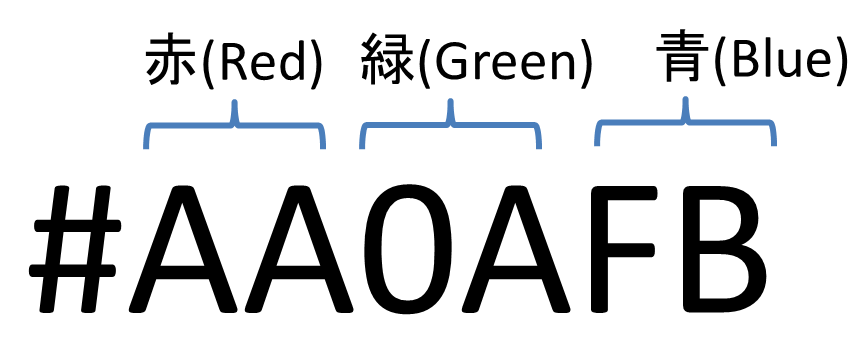

# Lesson4 罫線とグラフィック要素

## 4.1 XHTMLで罫線を表示する

- 罫線(```<hr>```タグ) => 水平線のこと
- ```<hr></hr>``` = > ```<hr/>```
	- align => 位置(右寄せ(right)、左寄せ(left)、中央揃え(center))
	- size => 線の太さ
	- width => 線の長さ
	- noshade => 影付きの指定(非推奨)

## 4.2 画像とWebページ

- 画像(``````タグ)
- ```</img>``` => ``````
	- src => 画像ファイルのある場所
	- alt => 代替テキスト
	- align => 配置(画像とテキストとの配置、P148参照)
	- width => 画像ファイルの幅(横)
	- height => 画像ファイルの高さ(縦)
	- border => 枠の太さ

### 4.2.1 画像ファイルの形式

- JPEG
	- 非可逆圧縮、但し、JPEG2000 => 可逆圧縮
	- 写真や複雑な画像
- GIF
	- 256色、GIF87a、GIF89a
	- GIF89a
		- 透過性 => 画像の一部を透明にする
		- インターレース => 画像を少しずつ描画する
		- アニメーション
- PNG
	- 透過性、インターレース、可逆圧縮、アニメーション

### 4.2.2 画像へのalt属性の設定

- XHTML文書で画像を使用する時は、必ずalt属性とその値(代替テキスト)を  
コード中に記述しなければなりません．

### 4.2.3 背景画像と背景色の組み合わせ

- Webページ内には、背景画像と背景色をそれぞれ指定できます．何らかの理由で  
背景画像が表示されない時のためにも、両方とも指定しておくのが得策でしょう．

### 4.2.4 テキスト中に画像を配置する

- 画像をテキストとの位置関係で配置するためにalign属性を使用する

## 4.3 特殊文字

- ```&copy;``` => ©(著作権マーク)
- ```&reg;``` => ®(登録商標)
- ```&lt;```(lt => less than ～ => ～より小さい) => ```<```
- ```&gt;```(gt => greater than ～ => ～より大きい) => >
- ```&nbsp;``` => 半角スペース

### 4.3.1 半角スペース文字(ノーブレークスペース)

- 連続してスペースを挿入するのに使用する

## 4.4 色指定

<p></p>