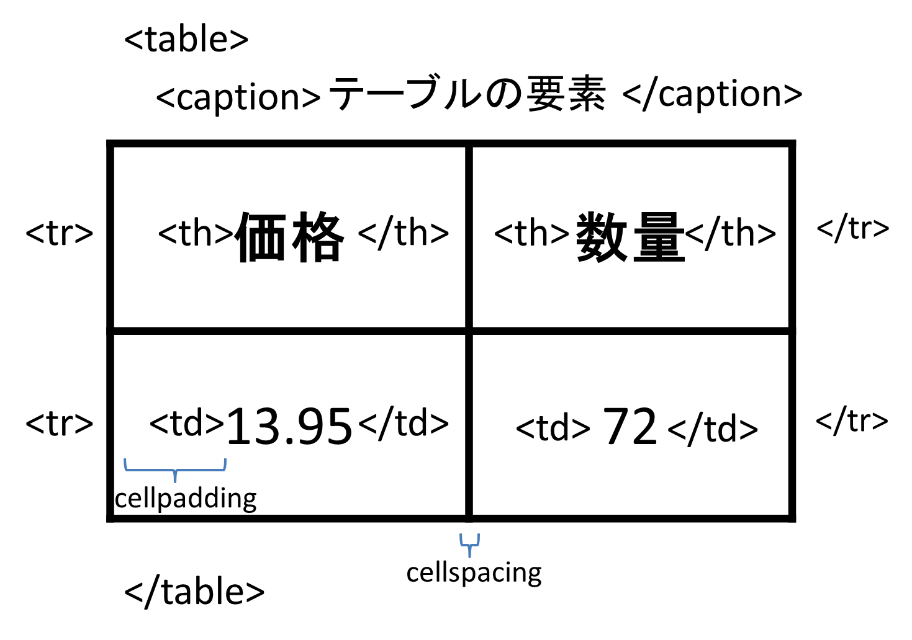

# Lesson6 テーブル

## 6.1 テーブルとは

<p></p>

### 6.1.1 XHTMLとテーブル

テーブルをページ全体のレイアウトに使用しない => スタイルシートと```<div>```タグ

### 6.1.2 ```<table>```タグの属性

- align => 水平位置(left/center/right)、非推奨
- border => 枠線(枠線の表示/非表示)
- cellpadding(値はピクセル数) => セル内の文字列とセル内側の枠線との間隔
- celspacing(値はピクセル数) => セル間の間隔
- width(値はピクセル数またはウィンドウ全体の何%) => テーブル全体の幅
- summary(音声認識ソフトウェア用) => テーブルの代わりとなる解説

### 6.1.3 ```<tr>```タグの属性

- align(left/center/right)  
=> その行にあるすべてのセルの文字列の水平位置
- valign(top/bottom/middle/baseline)  
=> その行にあるすべてのセルの文字列の垂直位置
- bgcolor => 各行の背景色、非推奨
- style(font/size/colorなど)  
=> 行の書式、インラインスタイルで指定

### 6.1.4 ```<td>```タグの書式

- align(left/center/right)  
=> 単一セル内のセルの水平位置
- valign(top/bottom/middle/baseline)  
=> 単一セル内の文字列の垂直位置
- colspan => 連続するセルの列数を指定
- rowspan => 連続するセルの行数を指定
- bgcolor => 各行の背景色、非推奨
- height => セルの高さ
- width => セルの幅

### 6.1.5 HTMLとXHTMLの違い

- align属性、bgcolor属性  
HTML 4.01規格 => 非推奨  
XHTML 1.0 Transitional => 使用可能  
XHTML 1.0 Transitional => サポートされていない
- テーブルの配置及び背景色の指定にはスタイルシートやインラインスタイル推奨

## 6.2 テーブルとデータの配置オプション

- 水平方向 => align属性
- 垂直方向 => valign属性

## 6.3 テーブル要素の高さと幅の変更

- 表や各セルの高さ => height
- 表や各セルの幅 => width

## 6.4 セルの連結

- 列の連結 => colspan
- 行の連結 => rowspan

## 6.5 表内のコンテンツの書式設定

```<strong>、<font>、<center>``` タグを使用