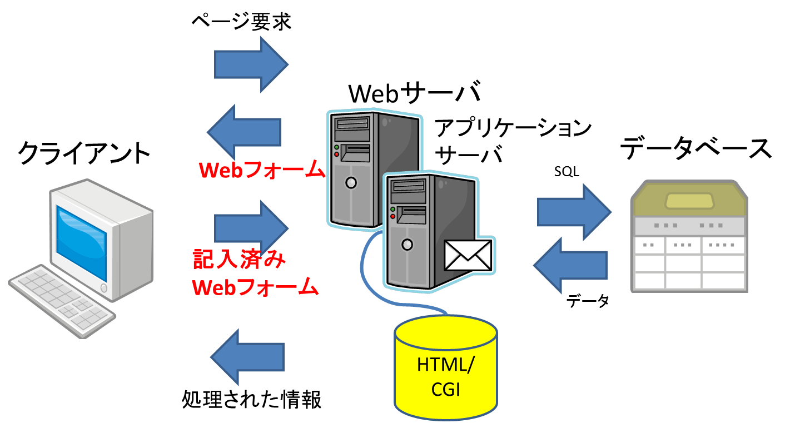
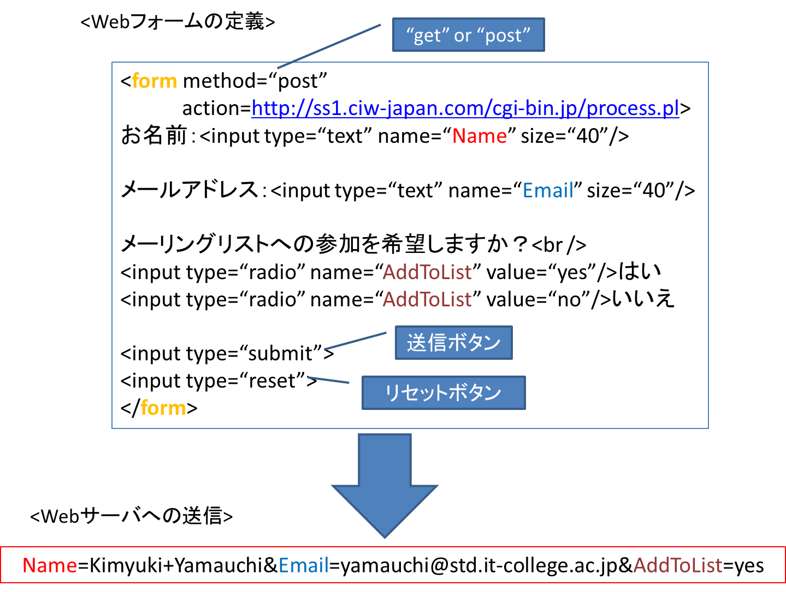

# Lesson7 Webフォーム

## 7.1 Webフォームとは

Webサイト(Webサーバ)がユーザからの入力を受け付ける手段

## 7.2 WebフォームとCGI

- CGIの機能
	- Webブラウザからデータを受信
	- 受信したデータの処理とデータ形式の編集

### 7.2.1 CGIセッションの処理の流れ

1. クライアントがWebフォームを受信
1. Webフォームに情報を入力
1. フォームの[送信]ボタンをクリック => Webサーバに送信
1. CGIにて情報を処理
1. 処理結果をクライントが受信

<p></p>

### 7.2.2 データ解析　フォーム処理/名前と値のペア/CGI

<p></p>

### 7.2.3 CGIスクリプトの適用例(FormMail)

- Webフォームからの情報を、Perlインタプリタを通して受け取り、それを電子メールで送る
- セキュリティ上の問題  
スパマー(スパムを送りつける人)に利用されないような設定
- 別バージョンのFormMail => PHP用/ASP用

## 7.3 ```<form>```タグ

### 7.3.1 method属性

ブラウザ => サーバへのデータの送信方法
- get => URLの後ろに「?」でつなげて送信
- post => リクエスト・ボディに格納されて送信

### 7.3.2 action属性

フォームの処理に使うCGIスクリプトの名前と場所を指定(URL)

### 7.3.3 ```<input>タグ、<select>タグ、<textarea>タグ```

## 7.4 Webフォームフィールド

- ```<input>```
	- type
		- text => テキストボックス
		- submit => 送信
		- reset => リセット
		- radio => ラジオボタン
		- checkbox => チェックボックス
		- file => ファイルのアップロード
		- password => パスワードフィールド
	- name
	- size
	- value
	- checked
- ```<select>```  
(単一/複数)選択リストボックス
	- name
	- multipule => 複数選択の指定
	- ```<option> => 選択項目(<select>に入れ子)```
- ```<textarea>```
	- cols => 横幅を文字数で指定
	- rows => テキストの行数を指定
	- wrap => ユーザが入力したテキストを右端で折り返すかどうか  
	の指定(“none” or “virtual”)