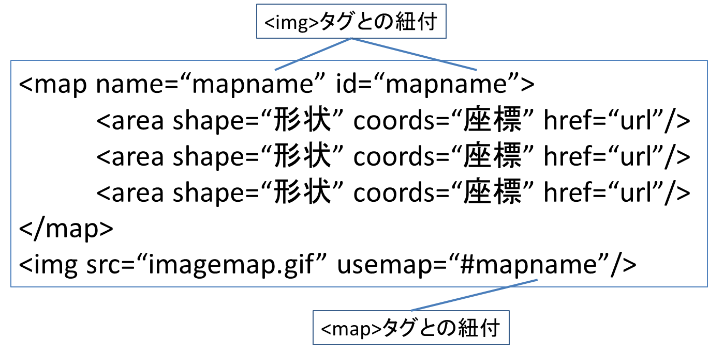

# Lesson8 画像の利用

## 8.1 Webでの画像の利用

### 8.1.1 画像の種類

- ベクター(Vector)  
=> 座標を指定して直線、曲線、形状を描画することで画像を作成  
=> 「Adobe Illustrator」、「Freehand」
- ビットマップ(Bitmap)  
=> 小さなドットを使用して画像を作成  
=> 「Paint Shop Pro」、「The GIMP」

## 8.2 イメージマップ

画像の中に特定の範囲にハイパーリンクを設定し、一つの画像にいくつもの  
ハイパーリンクを設定できる

### 8.2.1 クライアントサイドのイメージマップの設定

<p></p>

- ```<area>```タグ
	- shape属性
		- rect(四角形)
		- circle(円)
		- poly(多角形)
	- coord属性
		- rect(四角形) => 左上と右下の座標
		- circle(円) => 中心の座標と半径
		- poly(多角形) => それぞれの点の座標

## 8.3 画像の透過表示

- ページの背景が画像の透過色部分を通して見える
- GIF89a、PNG

## 8.4 インターレース

- Webブラウザ上に画像を表示するときに、ダウンロードに合わせて徐々に  
はっきりと表示させるようにする技術
- GIF87a、GIF89a、PNG

## 8.5 アニメーション

### 8.5.1 アニメーションGIF

### 8.5.2 Flashアニメーション

### 8.5.3 Javaアプレット

### 8.5.4 SVG(Scalable Vector Graphics)

- XMLを使ってベクター画像を描画
- クロスプラットフォームのアニメーション
- 圧縮機能
- 検索可能なテキスト
- ズーム機能

### 8.5.5 アニメーション技術を調べる

### 8.5.6 アニメーションに関する問題点