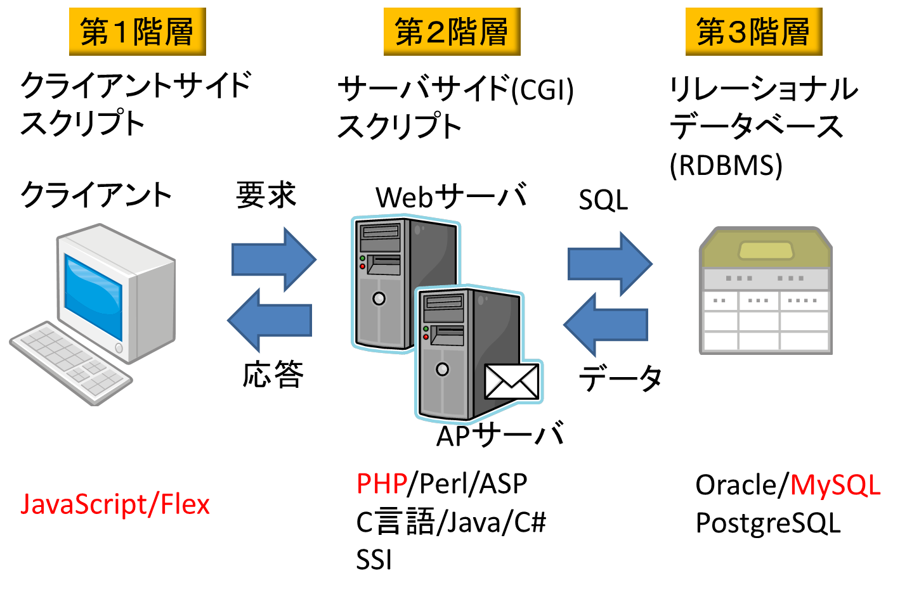

# Lesson11 高度なWeb技術

## 11.1 HTMLの拡張

- クライアントサイド/サーバサイドスクリプト
- CSS
- DHTML(XHTML or HTML/CSS/DOM)

## 11.2 サーバサイドスクリプトとクライアントサイドスクリプト

- 変数 => 情報を格納するメモリ領域
- 配列 => 集合を表すためのデータ構造、添え字で各要素にアクセス
- インタプリタ => ソースコードを読み取り、逐次実行
- コンパイル => ソースコードを機械語へ変換、機械語を実行

## 11.3 サーバサイドスクリプト

### 11.3.1 PHP

### 11.3.2 Perl

### 11.3.3 VBScriptを使ったASP

### 11.3.4 C言語

### 11.3.5 Java

### 11.3.6 C#

### 11.3.7 SSI

## 11.4 クライアントサイドスクリプト

### 11.4.1 クライアントサイドスクリプトの問題

### 11.4.2 JavaScript

### 11.4.3 VBScript

## 11.5 データベースへの接続

### 11.5.1 CGIとパーミッション

### 11.5.2 N階層アプリケーション

## 11.6 CSSを使ったスタイル適用方法

### 11.6.1 インラインスタイルの宣言

### 11.6.2 埋め込みスタイルの作成

### 11.6.3 スタイルシートのインポート

### 11.6.4 スタイルシートとWebブラウザの互換性

## 11.7 DHTML

## 11.8 DOM

### 11.8.1 WebブラウザのDOMにアクセスする

## 11.9 Webサービスプロバイダの利用

- ISP
- ASP(アプリケーションサービスプロバイダ)  
包括的なサービスの提供

### 11.9.1 ハウジング(コロケーション)、専用ホスティング、バーチャルサーバ

- ハウジングサービス  
サーバハードウェアは、ユーザが用意し、サービスプロバイダはサーバに必要なスペースと  
帯域幅を提供
- 専用サーバによるホスティングサービス  
サービスプロバイダは、自社の専用サーバへのアクセスをユーザに提供
- バーチャルサーバ  
１つのWebサーバに複数のサイトが格納される
- 独自のサーバ管理とサービスプロバイダの利用の比較

### 11.9.2 必要なものを伝えサービス価格を交渉する

### 11.9.3 サービスプロバイダから得ておくべき情報

- ISP、ASPと契約するときのポイント
	- トラフィック量の見込み
	- 必要とするハードディスクスペース
	- データベースとCGIの必要性
	- 必要な付加サービス(カスタムアプリケーションなど)
- ISP、 ASPから得ておくべき情報
	- アカウント情報
	- サーバのIPアドレスとドメイン名
	- ファイルやディレクトリ構成の関する説明 => DocumentRootなど
	- サービスプロバイダの連絡先